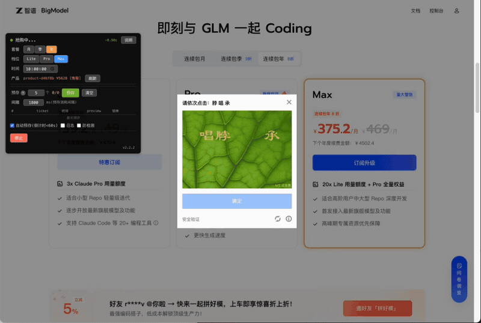
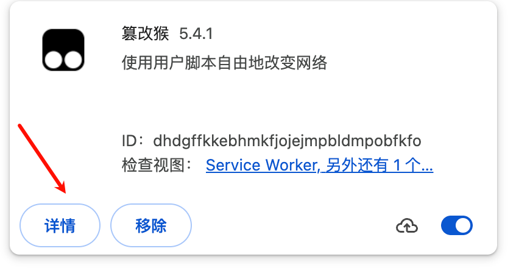
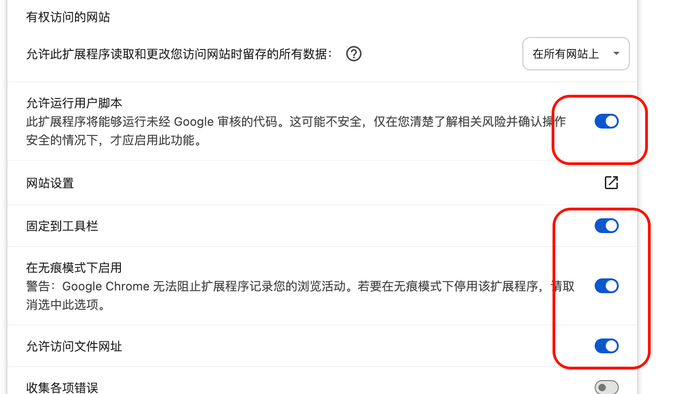
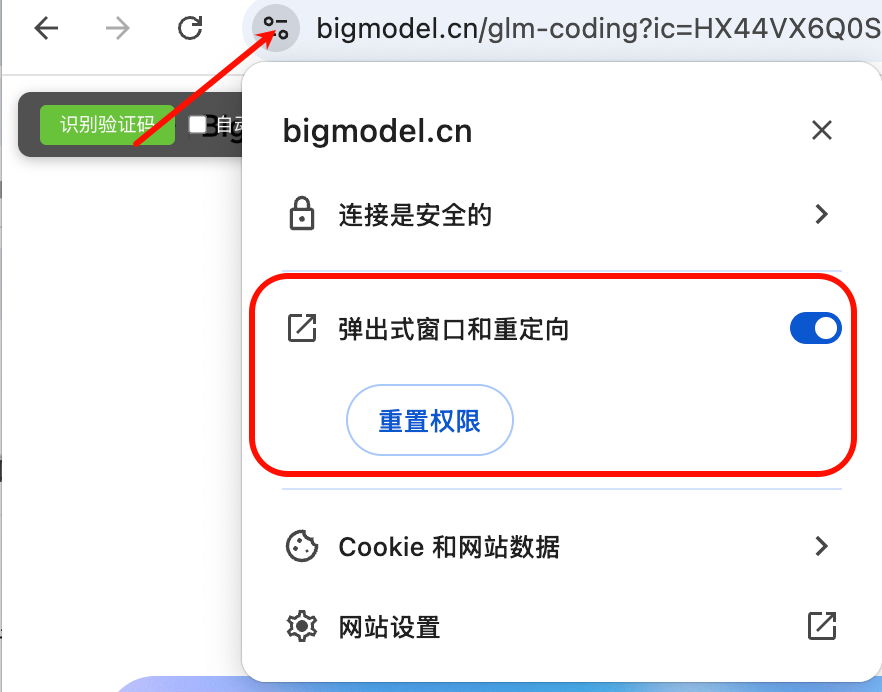
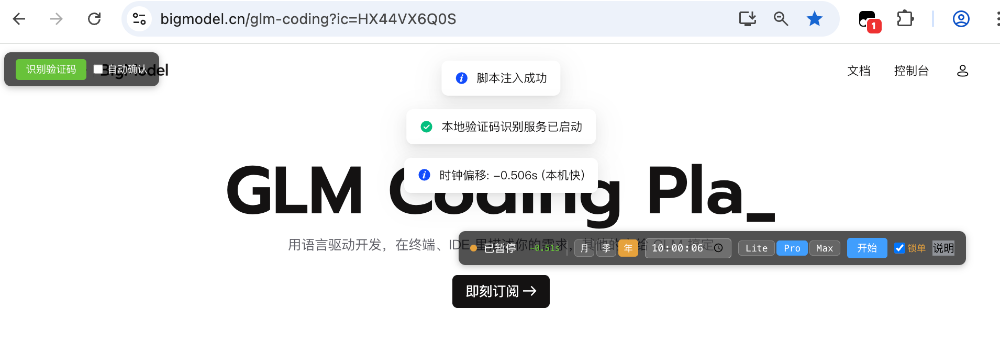

# GLM Coding 抢号脚本



油猴（Tampermonkey）用户脚本，用于定时自动抢购智谱 GLM Coding 套餐。

## 核心功能

### 验证码自动识别
基于本地 ddddocr 引擎，自动识别腾讯点选验证码。集成 5 种预处理 + OCR 投票、HOG 特征匹配、全排列搜索，识别速度约 **100ms**，远快于云打码服务。

### 自动锁单（强烈推荐）
preview 成功后直接调用 create-sign 接口锁单，跳过扫码跳转 pay-middle-page 的延迟。锁单成功后弹出支付宝二维码，扫码即可完成支付，无需担心售罄。
v2版本默认自动锁单

### 服务器时钟校准
自动测量本地与服务器的时间偏移（5 次采样取中位数），确保抢购时间精确卡点。

### 其他功能
- **预解题**：倒计时 20 秒时提前弹出验证码并识别汉字，到点只需点确认
- **连接预热**：倒计时 30 秒时开始发送请求预热 TCP 连接
- **555 繁忙处理**：将繁忙响应静默转换，阻止弹窗并持续重试
- **自动售罄重购**：售罄后自动重新发起购买，无需人工干预
- **可拖拽控制面板**：套餐类型、档位、时间一目了然，位置自动记忆

## 前置条件

- Chrome / Edge 浏览器
- [Tampermonkey](https://www.tampermonkey.net/) 扩展
- Python 3.8+（用于运行本地验证码识别服务）

## 安装步骤

### 1. 克隆项目

```bash
git clone <repo-url> glm-coding-grabber
cd glm-coding-grabber
```

### 2. 安装验证码识别服务依赖

```bash
cd captcha
pip install -r requirements.txt
```

依赖说明：
- `ddddocr` - OCR 识别引擎
- `flask` - HTTP 服务框架
- `Pillow` - 图片处理

### 3. 启动本地验证码识别服务

```bash
cd captcha
python ddddocr_server.py
```

服务默认监听 `http://127.0.0.1:9898`。

验证服务是否启动：
```bash
curl http://127.0.0.1:9898/health
# 返回: {"status":"ok","engine":"ddddocr","fonts":N}
```


> 脚本启动时会自动检测本地验证码服务，如果未启动会弹出警告提示。

### 4. 安装油猴脚本

#### 4.1 开启 Tampermonkey 开发者模式

1. 点击浏览器右上角 Tampermonkey 图标
2. 点击 **管理面板**
3. 点击 **设置** 标签页
4. 将 **配置模式** 切换为 **高级**



5. 在 **安全** 设置中，将 **允许访问文件网址** 设为 **开启**



#### 4.2 允许页面重定向（已优化可以不设置）
最新代码已优化，内部会打开小弹窗，可以不设置；设置的话会同时window.open打开二维码，更醒目 多窗口抢购建议设置；



#### 4.3 安装脚本

**方式一：直接导入文件**

1. 打开 Tampermonkey **管理面板**
2. 点击 **实用工具** 标签
3. 在 **从文件导入** 区域，选择本项目的 `index.js` 文件
4. 点击 **安装**

**方式二：手动创建**

1. 打开 Tampermonkey **管理面板**
2. 点击 **+** 新建脚本
3. 将 `index.js` 的全部内容复制粘贴进去
4. 按 `Ctrl+S` 保存

## 使用方法

### 1. 打开抢购页面

访问智谱 GLM Coding 页面（脚本会自动匹配 `https://*.bigmodel.cn/glm-coding*`）。

脚本启动后会：
- 自动同步服务器时间
- 检测本地验证码识别服务是否可用
- 在页面右上角显示控制面板

### 2. 控制面板说明

| 元素 | 说明 |
|------|------|
| 倒计时 | 显示距离抢购时间的剩余秒数 |
| 月/季/年 | 选择套餐类型 |
| 时间输入框 | 设置抢购目标时间（默认 10:00:00） |
| Lite/Pro/Max | 选择产品档位 |
| 开始/暂停 | 控制抢购运行状态 |
| 锁单 | 勾选后 preview 成功直接调 create-sign 锁单 |

### 3. 操作流程

1. 确保本地验证码服务已启动（`captcha/ddddocr_server.py`）
2. 进入抢购页面，等待脚本注入成功提示
3. 在控制面板设置目标时间和套餐
4. 勾选 **锁单**（强烈推荐）
5. 提前打开支付宝扫码页面
6. 点击 **开始**，脚本会在到点后自动抢购

### 4. 效果验证

可以提前设置一个已过的时间点触发抢购流程，验证脚本是否正常工作。



## 验证码识别服务

本地 ddddocr 服务的识别流程：

1. 检测验证码图片中的所有汉字区域
2. 对每个区域进行 5 种预处理 + OCR 集成投票
3. 用 HOG 特征 + 系统中文字体渲染进行匹配
4. 全排列搜索最优分配方案

识别速度约 100ms，远快于云服务。

详细说明见 [captcha/readme.md](captcha/readme.md)。

## 注意事项

- 抢购前 **不要刷新页面**，高峰期页面可能无法加载
- 提前进入抢购界面，确保页面数据已加载完成
- 本地验证码服务需要在抢购前启动
- 能否抢到仍需运气，建议提前做好准备
- 浏览器窗口高度不低于 900px，否则二维码可能无法正常显示

## 文件结构

```
glm-coding-grabber/
├── index.js              # 油猴脚本（合并后单文件）
├── README.md             # 本文件
├── doc/                  # 安装截图
│   ├── 1.脚本设置.png
│   ├── 2.脚本设置.png
│   ├── 4.运行验证码识别程序.png
│   ├── 5.允许重定向.png
│   └── 6.效果验证.png
└── captcha/
    ├── ddddocr_server.py # 本地验证码识别服务
    ├── requirements.txt  # Python 依赖
    └── readme.md         # 验证码服务详细说明
```
### 支持一下作者

如果觉得脚本有用，欢迎用我的分享链接抢购，你有 **5% 优惠**，我也会获得一些邀请赠送额度，感谢支持！

👉 [点击拼模](https://www.bigmodel.cn/glm-coding?ic=XYXVH4BD28)